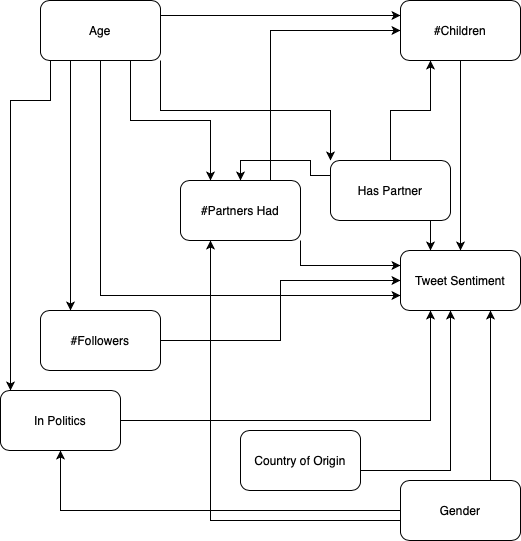

```{r setup, include=FALSE}
knitr::opts_chunk$set(echo = TRUE)
```


\tableofcontents


# Part 1 - Design and set-up of true experiment 


## The motivation for the planned research 
(Max 250 words)
The coronavirus pandemic has had a great impact on many aspects of society. University education, in particular, has changed significantly. As education in many countries has shifted from physical lectures to online teleconferencing lectures, concerns have been raised with regards to the effectiveness of this method of education. While the technological developments surrounding teleconferencing have enabled an almost seamless transition from offline to online education, it may be that the lack of a physically present lecturer affects the comprehensibility of the lecture material for students. With this research, we aim to address whether the students' understanding of the lecture material is affected by a different learning setting (i.e., from home watching an online lecture). The results may reveal whether online education is a way to move forward out of the pandemic. Moreover, if the results indicate no significant change in student understanding of material it may open up the way for new form of education, where students could enroll into "digital universities" without needing to be present at any time.

## The theory underlying the research  
<!-- (Max 250 words) Preferable based on theories reported in literature-->
<!-- I am not really covering how the experiments should be done, this may be important to add? Currently ~210 words.-->
Figlio et al. (2013) presented, according to them, the first experimental evidence on the effects of live versus online instruction. In this research, participants took an entire microeconomics course either only attending live lectures or online lectures. Exam performance was then compared between both groups and all students which did not volunteer to participate in the experiment but did still follow the course. Result showed that there is a modest difference in exam scores in favour of the students only attending live lectures, although the authors state that the experiments had many limitations and that further research is necessary. In contrary, a more recent survey by Nguyen (2015), which summarizes results of multiple studies, has found that 92% makes online education to be at least as effective, if not better, than live education. However, it is also important to recognize other issues that may arise when switching teaching modalities, which becomes clear when such a shift is forced due to, for example, the onset of COVID-19. In a very recent study by Finnegan (2021), results showed that while results are marginally worse after the shift to online teaching, student experience has deteriorated when their learning environment is suddenly changed, especially with students with poor online access.


## Research questions 
<!--
The research question that will be examined in the experiment (or alternatively the hypothesis that will be tested in the experiment)
-->

Our research question is the following: "How is students' understanding of lecture material affected by attending the lecture live rather than online?". We describe our null hypothesis and alternative hypothesis in the section on suggested statistical analyses.


## The related conceptual model 
This model should include:
*Independent variable(s)
*Dependent variable
*Mediating variable (at least 1)
*Moderating variable (at least 1)

The following sections describe the conceptual model for each type of variable:

### Independent Variable (IV)
The IV of this research is whether the participant (student) attends the lecture physically or from home through online teleconferencing. 

### Dependent Variable (DV)
The DV of this research is the relative score increase on the test that students make. Before the experiment the participants make a small test regarding the lecture material for which the score is expected to be low as the participants are expected to have no prior knowledge regarding the material. Then after the lecture the students make the same test regarding the lecture material. The relative increase (or unlikely decrease) of score will be the DV.

### Mediating Variable
As the students perform the test in a different setting (from home or on campus) depending on the IV. The change in setting is expected to have a mediating effect on the relationship  between the IV and DV.

### Moderating Variable
There are several factors which may a moderating effect on the relationship between the IV and the DV which are difficult control on the experiment. These mostly have to do with the environment in which the lecture is attended. The following list describes the specific variables which are believed to have this moderating effect:

- (online lecture) video/audio quality
- (online lecture) device that is used to attend lecture (e.g. laptop, tablet, smartphone)
- (both physical and online lecture) presence of noise and/or distraction in environment of watching lecture


## Experimental Design 
<!-- Note that the study should have a true experimental design -->
<!-- 
- Multiple lectures? (Different group sizes, different topics, etc.) 
- How to place the online group? (isolated in cubicles, Drebbelweg Tentamenzaal, etc.)
-->
In order to determine the difference between live and online lectures on students with respect to acquired knowledge the experimental design Pre-test Post-test randomized controlled trail was chosen. This means the participants can be tested before and after the lecture so that the difference in test results, the dependent variable, can be used as an indicator of knowledge gained from said lectures. For the lecture itself, the participants will be divided randomly over live and online groups such that the live group will attend a lecture face-to-face with a lecturer, and the online group will attend the lecture via an online platform such as Zoom. In order to minimize the influence of moderating variables such as video/audio quality and distractions, the online group will watch the lecture in a quiet, moderated environment on identical systems specifically set up for the experiment.

## Experimental procedure 
<!--
Describe how the experiment will be executed step by step
-->

First, we ask all students in the class who have agreed to participate in our experiment to perform a pre-test a day before the lecture. The pre-test will consist of questions composed by the teacher giving the lecture. The questions should reflect the main learning goals of the lecture. Ideally, this pre-test is done in a controlled setting on campus. If this is not possible due to governmental restrictions, the pre-test is performed online. All students perform the pre-test at the same time. After the pre-test, students are assigned to either the live lecture condition or the online lecture condition. To reduce unexplained variability, we will opt for a randomized block design. We will divide similar participants into blocks based on their pre-test scores. Then, we randomly assign participants from each block to the live condition or the online condition. Students in both conditions will follow the same lecture at the same time. A day after the lecture, the students perform a post-test. Just like the pre-test, the post-test will consist of questions composed by the teacher giving the lecture and should reflect the main learning goals of the lecture. However, the questions from the pre-test should not be repeated. Again, this post-test is ideally done in a controlled setting on campus, but may have to be performed online. 
<!--
Perhaps we could also create groups which do not perform the pre-test to see the influence of this test on the post-test results.
-->

## Measures
In the experiment, both participant groups will take a pre-test and a post-test. This test aims to evaluate the participants' comprehension of the lecture material. The pre-test is meant to serve as a baseline measurement to rule out any pre-existing knowledge of the participants. Both tests will be identical and will be in the form of a multiple choice exam of ten questions to be taken in a short time span (10 minutes). The score of the test is defined as the proportion of correct answers. The measure of the experiment is the ratio between these to tests for each particpant: the score of the post-test divided by the score of the pre-test. 

## Participants
<!-- Describe which participants will recruit in the study and how they will be recruited -->
<!-- What to add? -->
Participants should be students and could be recruited by asking for volunteers across a university campus. A small compensation could be offered in return as a sign of appreciation.

## Suggested statistical analyses
<!-- 
Describe the statistical test you suggest to care out on the collected data 
-->

First, we determine our null hypothesis $H_0$ and alternative hypothesis $H_1$. Our null hypothesis states that there is no difference in student understanding of the lecture material between the two different conditions. Our alternative hypothesis states that there is a difference in student understanding. We create two linear models to predict student understanding of lecture material. First, we create a model which has only an intercept. This model does not use the information about which condition a participant was in. This model will be referred to as $m_0$. Second, we create a model which does include this information ass a predictor. This model will be referred to as $m_1$. Then, we compare the fits of the two models to the data. We determine whether $m_1$ fits significantly better than $m_0$ through an ANOVA F-test. If this is not the case, we cannot reject our null hypothesis. We may also inspect the significance of the parameters of $m_1$. If the effect of the condition parameter is not significant, we cannot reject our null hypothesis.


# Part 2 - Generalized linear models

## Question 1 Twitter sentiment analysis (Between groups - single factor) 

### Conceptual model
<!-- Make a conceptual model for the following research question: Is there a difference in the sentiment of the tweets related to the different celebrities? -->


### Collecting tweets, and data preparation
Include the annotated R script (excluding your personal Keys and Access Tokens information), but put echo=FALSE, so code is not included in the output pdf file.


```{r, echo=FALSE, message=FALSE, warning=FALSE, include = FALSE}

#during writing you could add "eval = FALSE",  kntr will than not run this code chunk (take some time do)

source("working_dir.R")
setwd(wd) 
# apple , note use / instead of \, which used by windows


#install.packages("twitteR", dependencies = TRUE)
library(twitteR)
#install.packages("RCurl", dependencies = T)
library(RCurl)
#install.packages("bitops", dependencies = T)
library(bitops)
#install.packages("plyr", dependencies = T)
library(plyr)
#install.packages('stringr', dependencies = T)
library(stringr)
#install.packages("NLP", dependencies = T)
library(NLP)
#install.packages("tm", dependencies = T)
library(tm)
#install.packages("wordcloud", dependencies=T)
#install.packages("RColorBrewer", dependencies=TRUE)
library(RColorBrewer)
library(wordcloud)
#install.packages("reshape", dependencies=T)
library(reshape)

################### functions

  
clearTweets <- function(tweets, excl) {
  
  tweets.text <- sapply(tweets, function(t)t$getText()) #get text out of tweets 

  
  tweets.text = gsub('[[:cntrl:]]', '', tweets.text)
  tweets.text = gsub('\\d+', '', tweets.text)
  tweets.text <- str_replace_all(tweets.text,"[^[:graph:]]", " ") #remove graphic
  
  
  corpus <- Corpus(VectorSource(tweets.text))
  
  corpus_clean <- tm_map(corpus, removePunctuation)
  corpus_clean <- tm_map(corpus_clean, content_transformer(tolower))
  corpus_clean <- tm_map(corpus_clean, removeWords, stopwords("english"))
  corpus_clean <- tm_map(corpus_clean, removeNumbers)
  corpus_clean <- tm_map(corpus_clean, stripWhitespace)
  corpus_clean <- tm_map(corpus_clean, removeWords, c(excl,"http","https","httpst"))
  

  return(corpus_clean)
} 


## capture all the output to a file.

################# Collect from Twitter

# for creating a twitter app (apps.twitter.com) see youtube https://youtu.be/lT4Kosc_ers
#consumer_key <-'your key'
#consumer_scret <- 'your secret'
#access_token <- 'your access token'
#access_scret <- 'your access scret'

source("your_twitter.R") #this file will set my personal variables for my twitter app, adjust the name of this file. use the provide template your_twitter.R

setup_twitter_oauth(consumer_key,consumer_scret, access_token,access_scret) #connect to  twitter app


##### This example uses the following 3 celebrities: Donald Trump, Hillary Clinton, and Bernie Sanders
##  You should replace this with your own celebrities, at least 3, but more preferred 
##  Note that it will take the computer some to collect the tweets

tweets_J <- searchTwitter("#justinbieber", n=300, lang="en", resultType="recent") #300 recent tweets about Donald Trump, in English (I think that 1500 tweets is max)
tweets_T <- searchTwitter("#taylorswift", n=300, lang="en", resultType="recent") #300 recent tweets about Hillary Clinton
tweets_B <- searchTwitter("#billieeilish", n=300, lang="en", resultType="recent") #300 recent tweets about Bernie Sanders


######################## WordCloud
### This not requires in the assignment, but still fun to do 

# based on https://youtu.be/JoArGkOpeU0

#corpus_T<-clearTweets(tweets_T, c("trump","amp","realdonaldtrump","trumptrain","donald","trumps","alwaystrump")) #remove also some campain slogans
#wordcloud(corpus_T, max.words=50)

#corpus_C<-clearTweets(tweets_C, c("hillary","amp","clinton","hillarys"))
#wordcloud(corpus_C,  max.words=50)

#corpus_B<-clearTweets(tweets_B, c("bernie", "amp", "sanders","bernies"))
#wordcloud(corpus_B,  max.words=50)
##############################

######################## Sentiment analysis

tweets_J.text <- laply(tweets_J, function(t)t$getText()) #get text out of tweets 
tweets_T.text <- laply(tweets_T, function(t)t$getText()) #get text out of tweets
tweets_B.text <- laply(tweets_B, function(t)t$getText()) #get text out of tweets


#taken from https://github.com/mjhea0/twitter-sentiment-analysis
pos <- scan('positive-words.txt', what = 'character', comment.char=';') #read the positive words
neg <- scan('negative-words.txt', what = 'character', comment.char=';') #read the negative words

source("sentiment3.R") #load algoritm
# see sentiment3.R form more information about sentiment analysis. It assigns a intereger score
# by substracitng the number of occurrence of negative words from that of positive words

analysis_J <- score.sentiment(tweets_J.text, pos, neg)
analysis_T <- score.sentiment(tweets_T.text, pos, neg)
analysis_B <- score.sentiment(tweets_B.text, pos, neg)


sem<-data.frame(analysis_J$score, analysis_T$score, analysis_B$score)


semFrame <-melt(sem, measured=c(analysis_J.score,analysis_T.score, analysis_B.score ))
names(semFrame) <- c("Candidate", "score")
semFrame$Candidate <-factor(semFrame$Candidate, labels=c("Justin Bieber", "Taylor Swift", "Billie Eilish")) # change the labels for your celibrities

#The data you need for the analyses can be found in semFrame

```

### Homogeneity of variance analysis
Analyze the homogeneity of variance of sentiments of the tweets of the different celebrities, and provide interpretation

```{r}
#include your code and output in the document

library(car)

boxplot(semFrame$score ~ semFrame$Candidate)
leveneTest(semFrame$score, semFrame$Candidate, center = median)

```


### Visual inspection Mean and distribution sentiments
Graphically examine the mean and distribution sentiments of tweets for each celebrity, and provide interpretation

```{r}
#include your code and output in the document

#library(sm)

#sm.density.compare(data$score, data$Candidate)

```
### Frequentist approach

#### Linear model
Use a linear model to analyze whether the knowledge to which celebrity a tweet relates has a significant impact on explaining the sentiments of the tweets. Provide interpretation of results 

```{r}
#include your code and output in the document


```

#### Post Hoc analysis
If a model that includes the celebrity is better in explaining the sentiments of tweets than a model without such predictor, conduct a post-hoc analysis with e.g. Bonferroni correction, to examine which of celebrity tweets differ from the other celebrity tweets. Provide interpretation of the results

```{r}
#include your code and output in the document
```

#### Report section for a scientific publication
Write a small section for a scientific publication, in which you report the results of the analyses, and explain the conclusions that can be drawn.

### Bayesian Approach

#### Model description

Describe the mathematical model fitted on the most extensive model. (hint, look at the mark down file of the lectures to see example on formulate mathematical models in markdown). Justify the priors.

#### Model comparison

Conduct model analysis and provide brief interpretation of the results

```{r}
#include your code and output in the document
```

#### Comparison celebrity pair

Compare sentiments of celebrity pairs and provide a brief interpretation (e.g. CIs) 


## Question 2 - Website visits (between groups - Two factors)

### Conceptual model
Make a conceptual model underlying this research question

### Visual inspection
Graphically examine the variation in page visits for different factors levels (e.g. histogram, density plot etc.) 


```{r}
#include your code and output in the document
```


### Normality check
Visually inspect if variable page visits deviates from a Gaussian distribution, and discuss implication for general linear model analysis.


```{r}
#include your code and output in the document
```

### Frequentist Approach

#### Model analysis
Conduct a model analysis, to examine the added values of adding 2 factors and interaction between the factors in the model to predict page visits, and include brief interpretation of the results.


```{r}
#include your code and output in the document
```


#### Simple effect analysis
If the analysis shows a significant two-way interaction effect, conduct a Simple Effect analysis to explore this interaction effect in more detail.It helps first to look at the means of different conditions in a figure. Provide brief interpretation of the results.


```{r}
#include your code and output in the document
```


#### Report section for a scientific publication
Write a small section for a scientific publication, in which you report the results of the analyses, and explain the conclusions that can be drawn.

### Bayesian Approach

#### Model description

Describe the mathematical model fitted on the most extensive model. (hint, look at the mark down file of the lectures to see example on formulate mathematical models in markdown). Justify the priors.

#### Model comparison

Conduct model analysis and provide brief interpretation of the results

```{r}
#include your code and output in the document
```


# Part 3 - Multilevel model

## Visual inspection
Use graphics to inspect the distribution of the score, and relationship between session and score


```{r}
#include your code and output in the document
```

## Frequentist approach

### Multilevel analysis
Conduct multilevel analysis and calculate 95% confidence intervals, determine:

* If session has an impact on people score
* If there is significant variance between the participants in their score


```{r}
#include your code and output in the document
```

### Report section for a scientific publication
Write a small section for a scientific publication, in which you report the results of the analyses, and explain the conclusions that can be drawn.

## Bayesian approach

### Model description

Describe the mathematical model fitted on the most extensive model. (hint, look at the mark down file of the lectures to see example on formulate mathematical models in markdown). Justify the priors.

### Model comparison

Select the first 100 participants from the data set. (hint to overcome the Stan problem with a zero index, increase subject id number with 1). Compare models with with increasing complexity. 

```{r}
#include your code and output in the document
```

### Estimates examination

Examine the estimate of parameters of the model with best fitt, and provide a brief interpretation.


```{r}
#include your code and output in the document
```


