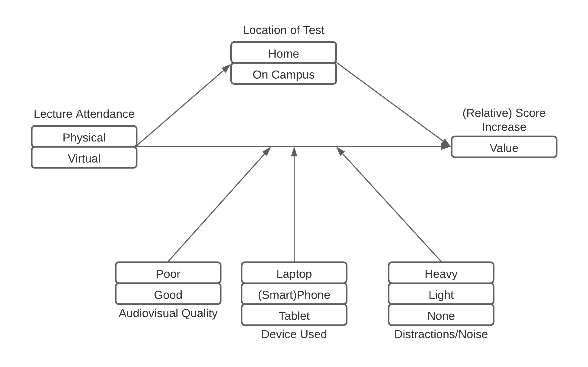
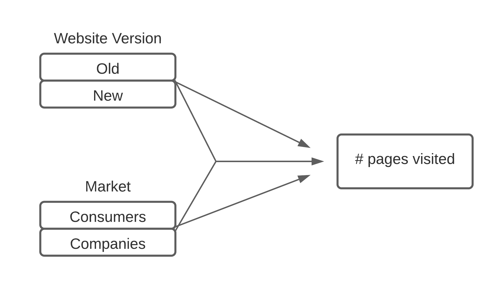

```{r setup, include=FALSE}
knitr::opts_chunk$set(echo = TRUE)
knitr::opts_chunk$set(fig.pos = 'H')

```

\tableofcontents

# Part 1 - Design and set-up of true experiment 

## The motivation for the planned research 
<!-- (Max 250 words) -->
The coronavirus pandemic has had a great impact on many aspects of society. University education, in particular, has changed significantly. As education in many countries has shifted from physical lectures to online teleconferencing lectures, concerns have been raised with regards to the effectiveness of this method of education. While the technological developments surrounding teleconferencing have enabled an almost seamless transition from offline to online education, it may be that the lack of a physically present lecturer affects the comprehensibility of the lecture material for students. With this research, we aim to address whether the students' understanding of the lecture material is affected by a different learning setting (i.e., from home watching an online lecture). The results may reveal whether online education is a way to move forward out of the pandemic. Moreover, if the results indicate no significant change in student understanding of material it may open up the way for new form of education, where students could enroll into "digital universities" without needing to be present at any time.

## The theory underlying the research  
<!-- (Max 250 words) Preferable based on theories reported in literature-->
<!-- I am not really covering how the experiments should be done, this may be important to add? Currently ~210 words.-->
Figlio et al. (2013) presented, according to them, the first experimental evidence on the effects of live versus online instruction. In this research, participants took an entire microeconomics course either only attending live lectures or online lectures. Exam performance was then compared between both groups and all students which did not volunteer to participate in the experiment but did still follow the course. Result showed that there is a modest difference in exam scores in favour of the students only attending live lectures, although the authors state that the experiments had many limitations and that further research is necessary. In contrary, a more recent survey by Nguyen (2015), which summarizes results of multiple studies, has found that 92% makes online education to be at least as effective, if not better, than live education. However, it is also important to recognize other issues that may arise when switching teaching modalities, which becomes clear when such a shift is forced due to, for example, the onset of COVID-19. In a very recent study by Finnegan (2021), results showed that while results are marginally worse after the shift to online teaching, student experience has deteriorated when their learning environment is suddenly changed, especially with students with poor online access.

## Research questions 
<!--
The research question that will be examined in the experiment (or alternatively the hypothesis that will be tested in the experiment)
-->

Our research question is the following: "How is students' understanding of lecture material affected by attending the lecture live rather than online?". We describe our null hypothesis and alternative hypothesis in the section on suggested statistical analyses.

## The related conceptual model 
<!-- This model should include: -->
<!-- *Independent variable(s) -->
<!-- *Dependent variable -->
<!-- *Mediating variable (at least 1) -->
<!-- *Moderating variable (at least 1) -->


```{r, echo=FALSE, fig.align='center', out.width="75%", fig.cap="The conceptual model underlying the research."}

```

The figure above displays the conceptual model for this research. The following sections describe the conceptual model for each type of variable:

### Independent Variable (IV)
The IV of this research is whether the participant (student) attends the lecture physically or from home through online teleconferencing. 

### Dependent Variable (DV)
The DV of this research is the relative score increase on the test that students make. Before the experiment the participants make a small test regarding the lecture material for which the score is expected to be low as the participants are expected to have no prior knowledge regarding the material. Then after the lecture the students make the same test regarding the lecture material. The relative increase (or unlikely decrease) of score will be the DV.

### Mediating Variable
As the students perform the test in a different setting (from home or on campus) depending on the IV. The change in setting is expected to have a mediating effect on the relationship  between the IV and DV. The Mediating Variable is thus whether the students take the _test_ at home or on campus.

### Moderating Variable
There are several factors which may a moderating effect on the relationship between the IV and the DV which are difficult control on the experiment. These mostly have to do with the environment in which the lecture is attended. The following list describes the specific variables which are believed to have this moderating effect:

- (relates only to online lecture) video/audio quality
- (relates only to online lecture) device that is used to attend lecture (e.g. laptop, tablet, smartphone)
- (relates to both physical and online lecture) presence of noise and/or distraction in environment of watching lecture


## Experimental Design 
<!-- Note that the study should have a true experimental design -->
<!-- 
- Multiple lectures? (Different group sizes, different topics, etc.) 
- How to place the online group? (isolated in cubicles, Drebbelweg Tentamenzaal, etc.)
-->
In order to determine the difference between live and online lectures on students with respect to acquired knowledge the experimental design Pre-test Post-test randomized controlled trail was chosen. This means the participants can be tested before and after the lecture so that the difference in test results, the dependent variable, can be used as an indicator of knowledge gained from said lectures. For the lecture itself, the participants will be divided randomly over live and online groups such that the live group will attend a lecture face-to-face with a lecturer, and the online group will attend the lecture via an online platform such as Zoom. In order to minimize the influence of moderating variables such as video/audio quality and distractions, the online group will watch the lecture in a quiet, moderated environment on identical systems specifically set up for the experiment.

## Experimental procedure 
<!--
Describe how the experiment will be executed step by step
-->
First, we ask all students in the class who have agreed to participate in our experiment to perform a pre-test a day before the lecture. The pre-test will consist of questions composed by the teacher giving the lecture. The questions should reflect the main learning goals of the lecture. Ideally, this pre-test is done in a controlled setting on campus. If this is not possible due to governmental restrictions, the pre-test is performed online. All students perform the pre-test at the same time. After the pre-test, students are assigned to either the live lecture condition or the online lecture condition. To reduce unexplained variability, we will opt for a randomized block design. We will divide similar participants into blocks based on their pre-test scores. Then, we randomly assign participants from each block to the live condition or the online condition. Students in both conditions will follow the same lecture at the same time. A day after the lecture, the students perform a post-test. Just like the pre-test, the post-test will consist of questions composed by the teacher giving the lecture and should reflect the main learning goals of the lecture. However, the questions from the pre-test should not be repeated. Again, this post-test is ideally done in a controlled setting on campus, but may have to be performed online. 

## Measures
In the experiment, both participant groups will take a pre-test and a post-test. This test aims to evaluate the participants' comprehension of the lecture material. The pre-test is meant to serve as a baseline measurement to rule out any pre-existing knowledge of the participants. Both tests will be identical and will be in the form of a multiple choice exam of ten questions to be taken in a short time span (10 minutes). The score of the test is defined as the proportion of correct answers. The measure of the experiment is the ratio between these to tests for each particpant: the score of the post-test divided by the score of the pre-test. 

## Participants
<!-- Describe which participants will recruit in the study and how they will be recruited -->
<!-- What to add? -->
Participants should be students and could be recruited by asking for volunteers on a university campus. In order to eliminate differences from different backgrounds, participants should be chosen from the same university programme (e.g. Computer Science or Mathematics). More participants is better, as this allows us to average out individual factors. Ideally, the live and online groups are about 300 participants each, both filling a lecture hall. There will be a variation in age, but because students are usually around the same age in a given univerisity program we can expect this variance to be small. A small compensation could be offered in return as a sign of appreciation.

## Suggested statistical analyses
<!-- 
Describe the statistical test you suggest to care out on the collected data 
-->
First, we determine our null hypothesis $H_0$ and alternative hypothesis $H_1$. Our null hypothesis states that there is no difference in student understanding of the lecture material between the two different conditions. Our alternative hypothesis states that there is a difference in student understanding. We create two linear models to predict student understanding of lecture material. First, we create a model which has only an intercept. This model does not use the information about which condition a participant was in. This model will be referred to as $m_0$. Second, we create a model which does include this information as a predictor. This model will be referred to as $m_1$. Then, we compare the fits of the two models to the data. We determine whether $m_1$ fits significantly better than $m_0$ through an ANOVA F-test. If this is not the case, we cannot reject our null hypothesis. We may also inspect the significance of the parameters of $m_1$. If the effect of the condition parameter is not significant, we cannot reject our null hypothesis.

# Part 2 - Generalized linear models

## Question 1 Twitter sentiment analysis (Between groups - single factor) 

### Conceptual model
<!-- Make a conceptual model for the following research question: Is there a difference in the sentiment of the tweets related to the different celebrities? -->


### Collecting tweets, and data preparation
<!-- Include the annotated R script (excluding your personal Keys and Access Tokens information), but put echo=FALSE, so code is not included in the output pdf file. -->

```{r, include=FALSE}
# Enable this for tweet downloading. If set to 'FALSE' semFrame.csv will be loaded.
download_tweets = FALSE
```

```{r, include=FALSE}
#during writing you could add "eval = FALSE",  kntr will than not run this code chunk (take some time do)
#source("working_dir.R")
#setwd(wd) 
# apple , note use / instead of \, which used by windows
#install.packages("twitteR", dependencies = TRUE)
library(twitteR)
#install.packages("RCurl", dependencies = T)
library(RCurl)
#install.packages("bitops", dependencies = T)
library(bitops)
#install.packages("plyr", dependencies = T)
library(plyr)
#install.packages('stringr', dependencies = T)
library(stringr)
#install.packages("NLP", dependencies = T)
library(NLP)
#install.packages("tm", dependencies = T)
library(tm)
#install.packages("wordcloud", dependencies=T)
#install.packages("RColorBrewer", dependencies=TRUE)
library(RColorBrewer)
library(wordcloud)
#install.packages("reshape", dependencies=T)
library(reshape)
################### functions
  
clearTweets <- function(tweets, excl) {
  
  tweets.text <- sapply(tweets, function(t)t$getText()) #get text out of tweets 
  
  tweets.text = gsub('[[:cntrl:]]', '', tweets.text)
  tweets.text = gsub('\\d+', '', tweets.text)
  tweets.text <- str_replace_all(tweets.text,"[^[:graph:]]", " ") #remove graphic
  
  
  corpus <- Corpus(VectorSource(tweets.text))
  
  corpus_clean <- tm_map(corpus, removePunctuation)
  corpus_clean <- tm_map(corpus_clean, content_transformer(tolower))
  corpus_clean <- tm_map(corpus_clean, removeWords, stopwords("english"))
  corpus_clean <- tm_map(corpus_clean, removeNumbers)
  corpus_clean <- tm_map(corpus_clean, stripWhitespace)
  corpus_clean <- tm_map(corpus_clean, removeWords, c(excl,"http","https","httpst"))
  
  return(corpus_clean)
} 
if (download_tweets) {
  ## capture all the output to a file.
  ################# Collect from Twitter
  
  # for creating a twitter app (apps.twitter.com) see youtube https://youtu.be/lT4Kosc_ers
  #consumer_key <-'your key'
  #consumer_scret <- 'your secret'
  #access_token <- 'your access token'
  #access_scret <- 'your access scret'
  
  source("your_twitter.R") #this file will set my personal variables for my twitter app, adjust the name of this file. use the provide template your_twitter.R
  
  setup_twitter_oauth(consumer_key,consumer_scret, access_token,access_scret) #connect to  twitter app
  
  ##  Note that it will take the computer some to collect the tweets
  
  tweets_J <- searchTwitter("#justinbieber", n=300, lang="en", resultType="recent") #300 recent tweets about Justin Bieber, in English
  tweets_T <- searchTwitter("#taylorswift", n=300, lang="en", resultType="recent") #300 recent tweets about Taylor Swift, in English
  tweets_B <- searchTwitter("#billieeilish", n=300, lang="en", resultType="recent") #300 recent tweets about Billie Eilish, in English
  
  ######################## Sentiment analysis
  
  tweets_J.text <- laply(tweets_J, function(t)t$getText()) #get text out of tweets 
  tweets_T.text <- laply(tweets_T, function(t)t$getText()) #get text out of tweets
  tweets_B.text <- laply(tweets_B, function(t)t$getText()) #get text out of tweets
  
  #taken from https://github.com/mjhea0/twitter-sentiment-analysis
  pos <- scan('positive-words.txt', what = 'character', comment.char=';') #read the positive words
  neg <- scan('negative-words.txt', what = 'character', comment.char=';') #read the negative words
  
  source("sentiment3.R") #load algoritm
  # see sentiment3.R form more information about sentiment analysis. It assigns a intereger score
  # by substracitng the number of occurrence of negative words from that of positive words
  
  analysis_J <- score.sentiment(tweets_J.text, pos, neg)
  analysis_T <- score.sentiment(tweets_T.text, pos, neg)
  analysis_B <- score.sentiment(tweets_B.text, pos, neg)
  
  
  sem<-data.frame(analysis_J$score, analysis_T$score, analysis_B$score)
  
  
  semFrame <-melt(sem, measured=c(analysis_J.score,analysis_T.score, analysis_B.score ))
  names(semFrame) <- c("Candidate", "score")
  semFrame$Candidate <-factor(semFrame$Candidate, labels=c("Justin Bieber", "Taylor Swift", "Billie Eilish"))
  write.csv(semFrame, "semFrame.csv", row.names = FALSE)
} 
if (!download_tweets) {
  semFrame = read.csv("semFrame.csv", stringsAsFactors = TRUE)
}
```

### Homogeneity of variance analysis
<!-- Analyze the homogeneity of variance of sentiments of the tweets of the different celebrities, and provide interpretation -->
From the boxplot containing the distribution of tweet sentiments for all three celebrities we can conclude that there is a visible difference in sentiment variance. Performing Levene's test verifies this. In the results of that test we can see that the effect is significant ($p<0.05$). This indicates that there is variance inequality between all three groups of tweets.

```{r, message=FALSE, warning=FALSE, echo = T, results = 'hide'}
library(car)
library(pander)
```
```{r, fig.cap="Boxplot of the sentiment values of the tweets for each celebrity."}
boxplot(semFrame$score ~ semFrame$Candidate)
```
```{r, fig.cap="Results of performing Levene's test on the three groups of tweets about the three celebrities."}
pander(leveneTest(semFrame$score, semFrame$Candidate, center = median))
```

### Visual inspection Mean and distribution sentiments
<!-- Graphically examine the mean and distribution sentiments of tweets for each celebrity, and provide interpretation -->
Analysing the bar graph of sentiment counts for all tweets for each celebrity, we can see that in general tweets about Justin Bieber are the most positive, with most tweets having a sentiment around 0.5, while tweets about Taylor Swift are a bit less positive. Tweets about Billie Eilish are the most negative, or rather, most neutral with the most tweets having sentiment values of 0.

```{r, message=FALSE, warning=FALSE, echo = T, results = 'hide', cache=TRUE}
library(ggplot2)
p <- semFrame %>% ggplot( aes(x=score)) + geom_histogram( color="#e9ecef", alpha=0.6, position = 'identity') + facet_grid(. ~ Candidate)
```
```{r, fig.cap="Bar plot for the tweet sentiment values for each celebrity."}
plot(p)
```

### Frequentist approach

#### Linear model
<!-- Use a linear model to analyze whether the knowledge to which celebrity a tweet relates has a significant impact on explaining the sentiments of the tweets. Provide interpretation of results  -->
Comparing the AIC of a null model ($m_0$) and a model where celebrity is added as a predictor ($m_1$) shows that there is an improvement with the latter model with respect to the quality of the fit, as the AIC is lower with $m_1$. Performing an F-test shows that there is a significant difference in fit between both models. This means that knowing the celebrity gives information about the distribution of tweet sentiments in the data set.

```{r, message=FALSE, warning=FALSE, echo = T, results = 'hide', cache=TRUE}
library(pander)
library(multcomp)
library(stats)
library(AICcmodavg)
semFrame$CandidateF <-factor(semFrame$Candidate, 
                             levels=c("Justin Bieber", "Taylor Swift", "Billie Eilish"), 
                             labels=c("Justin Bieber", "Taylor Swift", "Billie Eilish"))
m0 = lm(score ~ 1, data=semFrame)
m1 = lm(score ~ CandidateF, data=semFrame)
models = list(m0,m1)
model.names = c("Model 0", "Model 1")
```

```{r fig.cap="WAIC scores for the null model and the model with celebrity added as predictor."}
pander(aictab(cand.set=models, modnames=model.names))
```

``` {r fig.cap="Effect pre-post measuring condition on the tweet sentiments of the three celebrities."}
pander(anova(m0, m1))
```


#### Post Hoc analysis
<!-- If a model that includes the celebrity is better in explaining the sentiments of tweets than a model without such predictor, conduct a post-hoc analysis with e.g. Bonferroni correction, to examine which of celebrity tweets differ from the other celebrity tweets. Provide interpretation of the results -->
Performing Post Hoc analysis allows us to determine whether there is a significant difference in tweet sentiments between all three celebrities, and how the distribution changes between them. The results, obtained by performing Tukey's Honest Significant Difference test, show that there is a significant difference in tweet sentiments for all three celebrities. Tweets about Justin Bieber ($M=0.89,SD=0.69$) are the most positive, while those about Billie Eilish ($M=0.28, SD=0.63$) are most negative, confirming our findings in the visual inspection. Taylor Swift's ($M=0.66, SD=0.67$) are a bit less positive than Justin Bieber's.

```{r, message=FALSE, warning=FALSE, echo = T, results = 'hide', cache=TRUE}
library(stats)
mean(semFrame[semFrame$CandidateF=="Justin Bieber", "score"])
sd(semFrame[semFrame$CandidateF=="Justin Bieber", "score"])
mean(semFrame[semFrame$CandidateF=="Taylor Swift", "score"])
sd(semFrame[semFrame$CandidateF=="Taylor Swift", "score"])
mean(semFrame[semFrame$CandidateF=="Billie Eilish", "score"])
sd(semFrame[semFrame$CandidateF=="Billie Eilish", "score"])
res.aov <- aov(score~CandidateF, data = semFrame, na.action = na.exclude)
```

```{r, fig.cap="Results of performing Tukey's HSD."}
TukeyHSD(res.aov)
```

#### Report section for a scientific publication
<!-- Write a small section for a scientific publication, in which you report the results of the analyses, and explain the conclusions that can be drawn. -->
In order to determine whether sentiment of tweets depend on the celebrity they are about, a null model and a model with celebrity added as a independent variable predictor have been constructed. Results showed that the fit was significantly better ($F(2, 897) = 44.39$, p. < 0.01) when the null model ($AIC=1942$) had celebrity added as predictor ($AIC=1827$). We can therefore conclude that the Twitter user base tweets differently about Justin Bieber ($M=0.89,SD=0.69$), Taylor Swift ($M=0.66, SD=0.67$), and Billie Eilish ($M=0.28, SD=0.63$). Further analysis using Post Hoc analysis using Tukey's Honest Significant Difference test showed that there is a significant difference in tweet sentiment distribution in all three celebrity pairs, Taylor Swift - Justin Bieber (p. < 0.01), Billie Eilish - Justin Bieber (p. < 0.01), and Taylor Swift - Billie Eilish (p. < 0.01).

### Bayesian Approach

#### Model description

<!-- Describe the mathematical model fitted on the most extensive model. (hint, look at the mark down file of the lectures to see example on formulate mathematical models in markdown). Justify the priors. -->
The most complex model tested uses the celebrity as an independent variable to predict the score. As we can expect the tweet sentiments to be normally distributed around 0 with almost all data between -5 and 5 due to the tweet word limit, a normally distributed prior with $\mu=0$ and $\sigma =2$ is used for $\mu$, and we allow $\sigma$ to take a value between 0.0001 and 5. To investigate the influence of Celebrity we add it as a factor and transform the intercept parameter into an index variable, giving us the following model:

$$
\begin{aligned}
score &\sim Normal(\mu, \sigma) \\
\mu &= a_{Candidate} \\
a_{Candidate} &\sim Norm(0, 2) \\
\sigma &\sim Uniform(0.001, 5) \\
\end{aligned}
$$

#### Model comparison
<!-- Conduct model analysis and provide brief interpretation of the results -->
The figure below depicts the difference in WAIC score between the null model ($m_0$, $WAIC=1943$) and the null model with Celebrity added as a factor ($m_1$, $WAIC=1829$). It is clear that the fit is better when the Celebrity factor is added, as the WAIC score is lower. Looking at the next figure we can see the credibility intervals for the vector parameters for the mean of model $m_1$. It is clear that the means of all three celebrities are different from one another, indicating that people tweet differently about the different celebrities.


```{r, message=FALSE, warning=FALSE, echo = T, results = 'hide', cache=TRUE}
library("rstan")
library("rethinking")
m0 <-ulam(
  alist(
    score ~ dnorm(mu, sigma),
    mu <- a,
    a ~ dnorm(0, 2),
    sigma ~ dunif(0.0001, 5)),
  data =  semFrame ,iter = 10000, chains = 4, cores = 4, control=list(adapt_delta=.99), log_lik=TRUE
)
m1 <-ulam(
 alist(
   score ~ dnorm(mu, sigma),
   mu <- a[CandidateF] ,
   sigma ~  dunif(0.0001, 5),
   a[CandidateF] ~ dnorm(0, 2)),
 data =  semFrame ,iter = 10000, chains = 4, cores = 4, control=list(adapt_delta=.99), log_lik=TRUE
)
```

```{r bayes_celeb_waic, fig.cap="Comparison of the WAIC score for each model."}
plot(compare(m0, m1))
```

```{r bayes_celeb_params, fig.cap="Confidence intervals for the parameters of the model with celebrity added as a predictor."}
plot(precis(m1, depth=2, prob = .95))
```

#### Comparison celebrity pair

<!-- Compare sentiments of celebrity pairs and provide a brief interpretation (e.g. CIs)  -->
Using `_bayes.t.test_` we can analyse the difference in tweet sentiment distributions for each celebrity pair. From the plots we can deduce that for all three celebrity pairs there is a difference between the means, Justin Bieber ($Mean=0.9$), Taylor Swift ($Mean=0.66$), and Billie Eilish ($Mean=0$). Furthermore, the credibility intervals for the effect size do not contain 0 for all celebrity pairs, indicating that knowing the celebrity gives information about the tweet sentiment distribution and thus the fit of a model is better if Celebrity is used as a predictor.

```{r, message=FALSE, warning=FALSE, echo = T, results = 'hide'}
# Might have to do 'brew install jags' on Mac to make this work.
library(rjags)
devtools::install_github("rasmusab/bayesian_first_aid")
library(BayesianFirstAid)
jbSub <- subset(semFrame, (CandidateF == "Justin Bieber"))
tsSub <- subset(semFrame, (CandidateF == "Taylor Swift"))
beSub <- subset(semFrame, (CandidateF == "Billie Eilish"))
```

``` {r, fig.cap="Results of performing the bayes t-test on the pair Justin Bieber - Taylor Swift."}
plot(bayes.t.test(jbSub$score, tsSub$score))
```

``` {r, fig.cap="Results of performing the bayes t-test on the pair Justin Bieber - Billie Eilish."}
plot(bayes.t.test(jbSub$score, beSub$score))
```

``` {r, fig.cap="Results of performing the bayes t-test on the pair Taylor Swift - Billie Eilish."}
plot(bayes.t.test(tsSub$score, beSub$score))
```

## Question 2 - Website visits (between groups - Two factors)

### Conceptual model


```{r, echo=FALSE, fig.align='center', out.width="50%", fig.cap="The conceptual model underlying the research."}

```

### Visual inspection
<!--Graphically examine the variation in page visits for different factors levels (e.g. histogram, density plot etc.)-->
The first step in our inspection is to observe the distribution of the dependent variable overall regardless of the factors. We plot a histogram of all the page visits:

```{r, message=FALSE, warning=FALSE}
library(ggplot2)
library(magrittr)
library(dplyr)     
web_visit <- read.csv("webvisit0.csv")
web_visit$version <- factor(x=web_visit$version, labels=c("old", "new"))
web_visit$portal <- factor(x=web_visit$portal, labels=c("consumers", "companies"))
```


```{r, warning=FALSE, message=FALSE, fig.align='center', out.width="40%", fig.cap="Histogram showing page visits on the website over all factors."}
p <- web_visit %>% ggplot(aes(x=pages)) + geom_histogram(bins=10)
plot(p)
```

To determine whether either of the IV's have an effect on the distribution of the page visits we observe the distributions under different instantiations of the IV's in the following figure:

```{r, warning=FALSE, message=FALSE, fig.cap="Histograms of page visits on the website per independent variable."}
p <- web_visit %>% ggplot( aes(x=pages)) + geom_histogram(bins=10) + facet_grid(portal ~ version)
plot(p)
```

The following table shows summary statistics of the page visits across groups of the IV's:

```{r}
grouped <- group_by(web_visit, version, portal)
pander(summarise(grouped, mean=mean(pages), sd=sd(pages)), caption = "Summary statistics across groups of the IV's")
```

To further assist our understanding of the distribution we will also draw boxplots of the same data to observe differences in the distribution:

```{r, warning=FALSE, message=FALSE, fig.cap="Boxplots of page visits on the website per independent variable"}
p <- web_visit %>% ggplot( aes(y=pages)) + geom_boxplot() + facet_grid(portal ~ version, scales = "free_x", space = "free_x") + theme( axis.title.x=element_blank(), axis.text.x=element_blank(), axis.ticks.x=element_blank())
plot(p)
```
Based on the figures it seems that the IV's do affect the distribution of the DV. While the distributions between the old and new website for consumers do not show clearly different distributions, in the other cases there seems to be a significant difference. In particular, the distributions over the old and new website for companies shows a clearly different distribution in the histograms as well as in the boxplots. 

### Normality check
<!--Visually inspect if variable page visits deviates from a Gaussian distribution, and discuss implication for general linear model analysis.-->

Again, we take the histograms over all the IV's and plot a density on top of it to see if a normal distribution can be observed in the data.

```{r, message=FALSE, warning=FALSE, fig.cap="Density plots fitted to data of page visits"}
p <- web_visit %>% ggplot(aes(x=pages)) + 
  geom_histogram(aes(y=..density..), bins=10, colour = "white", fill="grey75") + 
  facet_wrap(portal~version, scales = "free") +
  geom_density(aes(y=..density..), colour="blue") 
plot(p)
```

The figure shows that in almost all cases the distribution of the data does not fit to a normal distribution, except for the case of the old website on the company portal. This does not have to be an issue for the general linear model analysis as the assumption over the distribution of the data only applies to the errors. The assumption is that the errors are normally distributed. However, for the analysis we will consider a Poisson distribution which will be a better fit to the distributions visible in the density plots. The companies-old plot seems like a Poisson distribution with $\lambda = 4$ whereas the other plots seem more like a Poisson distribution with approximately $\lambda = 1$.

### Frequentist Approach

#### Model analysis
<!--Conduct a model analysis, to examine the added values of adding 2 factors and interaction between the factors in the model to predict page visits, and include brief interpretation of the results.-->
First we perform Levene's Test to determine the homogeneity of variance. 

```{r, warning=FALSE}
library(car)
library(pander)
pander(leveneTest(web_visit$pages, interaction(web_visit$version , web_visit$portal)))
```

The p-value of Levene's Test in this case is larger than 0.05 and this thus indicates that the variance is homogeneous. Our assumptions on the data which allows for linear model fitting still hold.

The following tables show the results of fittings linear models and comparing them using ANOVA. To compare the models and test a significant deviance between the models, Pearson's chi-squared test is used. 

The first table shows whether adding the website version as a predictor for the page visits has a significant effect. The results show indeed that there is a significant effect. The second table indicates the same, but in this case for the portal of the website (i.e. market), this effect is also significant. The third table indicates whether there is an interaction effect between the two factors, which is also significantly demonstrated. The final table shows the combined effect of the two factors as well as the interaction.

```{r, warning=FALSE, message=FALSE}
model0 <- glm(pages ~ 1 , data = web_visit, na.action = na.exclude, family = "poisson")
model1 <- glm(pages ~ version , data = web_visit, na.action = na.exclude, family = "poisson")
model2 <- glm(pages ~ portal , data = web_visit, na.action = na.exclude, family = "poisson")
model3 <- glm(pages ~ version + portal , data = web_visit, na.action = na.exclude, family = "poisson")
model4 <- glm(pages ~ version + portal + version:portal , data = web_visit, na.action = na.exclude, family = "poisson")
```
```{r}
pander(anova(model0,model1, test = "Chisq"), caption = "Website version as main effect on page visits")
pander(anova(model0,model2, test = "Chisq"), caption = "Portal type as main effect on page visits")
pander(anova(model3,model4, test = "Chisq"),caption = "Interation effect on top of two main effects")
pander(anova(model4, test = "Chisq"),caption = "Effect of Website version, Portal type and interaction effect on page visits")
```

The results justify a further investigation into the effects of the factors. However, we will first also evaluate the goodness of fit of the final statistical model through a Akaike Information Criterion (AIC) comparison:

```{r, warning=FALSE, message=FALSE}
library(AICcmodavg)
models <-list(model0, model1, model2, model3, model4)
model.names <-c("model0","model1","model2","model3","model4")
```


```{r}
pander(aictab(cand.set = models, modnames=model.names))
```

The analysis shows that the final model had the best goodness of fit and, in fact, captures all predictive power that could be found in the full set of models. 

#### Simple effect analysis
<!--If the analysis shows a significant two-way interaction effect, conduct a Simple Effect analysis to explore this interaction effect in more detail.It helps first to look at the means of different conditions in a figure. Provide brief interpretation of the results.-->
As we have previously found a two-way interaction effect between the version and portal factors of the experiment, we will conduct a Simple Effect analysis to explore this interaction effect. 

The following bar plot shows how the page visits vary over the factors.
```{r, warning=FALSE, message=FALSE, fig.align='center', out.width="50%", fig.cap="Bar plot showing the mean page visits per independent variable."}
bar <- ggplot(web_visit, aes(portal , pages, fill = version))
bar + stat_summary(fun.y = mean, geom = "bar", position="dodge")
```

The plot clearly shows that there is a greater difference between the old and new versions of the website for the company portal. The Simple effect analysis will be conducted through a linear model fitted to contrasts on the consumer and company variables.

```{r, warning=FALSE, message=FALSE}
web_visit$simple <- interaction(web_visit$version, web_visit$portal)
levels(web_visit$simple)
contrastConsumers <-c(1,-1,0,0) #Only the consumer portal data 
contrastCompanies <-c(0,0,1,-1) #Only the company portal data
SimpleEff <- cbind(contrastConsumers,contrastCompanies)
contrasts(web_visit$simple) <- SimpleEff 
```

```{r, warning=FALSE, message=FALSE}
simpleEffectModel <-lm(pages ~ simple , data = web_visit, na.action = na.exclude) 
pander(summary.lm(simpleEffectModel))
```

The Simple effect analysis demonstrates no significant difference between page visits for users in the consumer portal using new and old versions of the website. However, it demonstrates that there is a significant difference for users in the company portal.

#### Report section for a scientific publication

```{r}
grouped <- group_by(web_visit, version, portal)
pander(summarise(grouped, mean=mean(pages), sd=sd(pages)), caption = "Summary statistics across groups of the IV's")
```

<!-- Write a small section for a scientific publication, in which you report the results of the analyses, and explain the conclusions that can be drawn. -->
A Poisson general linear model was fitted on the amount of page visits for users of a website, taking as independent variables the website version (new or old) and the user portal (consumer or company). The analysis found a significant main effect ($F(1,995)=36.2,\ p.< 0.01$) for the website version as well as for the portal ($F(995,1)=178.8,\ p.<0.01$). Moreover, the analysis found a significant two-way interaction effect ($F(1,995)=46.2,\ p.<0.01$). Overall, the old website version on the company portal had the highest mean page visits: 4.03 ($\sigma = 1.69$), followed by the new website version for the company portal: 2.72 ($\sigma = 1.63$). The consumer portals had a mean amount of page visits of 1.99 ($\sigma = 1.58$) and 2.05 ($\sigma =1.48$) for the old and new website version respectively. A Simple Effect analysis was conducted to further examine the two-way interaction between the independent variables. It revealed a significant ($t=9.22,\ p. 0.01$) difference for website version in the company portal of the website but no significant effect ($t=13.4,\ p=0.67$) for the website version in the consumer portal.

### Bayesian Approach

#### Model description
<!-- Describe the mathematical model fitted on the most extensive model. (hint, look at the mark down file of the lectures to see example on formulate mathematical models in markdown). Justify the priors. -->

Our most extensive Bayesian model captures each individual factor as well as the interaction of the factors and is defined as follows:

$$
\begin{aligned}
  \text{PageVisits} & \sim \text{Poisson}(\lambda) \\
  \lambda & = a + b \cdot \text{Version} + c \cdot \text{Portal} + d\cdot \text{Version} \cdot \text{Portal} \\
  a & \sim N(1.5, 5) \\ 
  b & \sim N(0, 5) \\
  c & \sim N(0, 5) \\ 
  d  & \sim N(0, 5) 
\end{aligned}
$$


Here the functions $\text{Poisson}$, $N$ and $U$ denote the probability functions of the Poisson, Normal and Uniform distributions respectively. 

The Poisson distribution was chosen as a prior as previous plots of the page visits shows the distribution to follow a Poisson distribution. By means of visual inspection the parameter $\lambda=1.5$  was chosen. See the figure below for a fit of the distribution to the data with these parameters. The other parameters are fitted to a normal distribution around 0 with a standard deviation of 5 to reflect the uncertainty of the effects that the variables may have.

```{r, warning=FALSE, message=FALSE, fig.align='center', out.width="50%", fig.cap="Poisson distribution (lambda = 1.5) fitted to data of page visits"}
p <- web_visit %>% 
  ggplot( aes(x=pages)) + 
  geom_histogram(aes(y =..density..), bins=15) + 
  stat_function(n = max(web_visit$pages), fun = dpois, geom="line", args = list(lambda=1.5))
plot(p)
```

#### Model comparison
<!-- Conduct model analysis and provide brief interpretation of the results -->
Besides the previously defined model, we defined simpler models which capture the effects of the factors on their own and their joint as well as interaction effect.  

```{r, warning=FALSE, message=FALSE, results = 'hide', echo=T, cache=TRUE}
library("rstan")
library("rethinking")
web_visit <- subset(web_visit, select = c(pages,version, portal )) 
web_visit$versionN <- as.numeric(web_visit$version)
web_visit$portalN <- as.numeric(web_visit$portal)
m0 <-map2stan( alist(
    pages ~ dpois(lam), 
    lam <- a,
    a ~ dnorm(1.5,5)),
  data = web_visit, iter = 1000, chains = 4, cores = 4
)
m1 <-map2stan( alist(
    pages ~ dpois(lambda), lambda <- a + b*versionN,
    a ~ dnorm(1.5,5),
    b ~ dnorm(0, 5)),
  data = web_visit,iter = 10000, chains = 4, cores = 4
)
  
m2 <-map2stan( alist(
    pages ~ dpois(lambda), lambda <- a + c*portalN ,
    a ~ dnorm(1.5,5),
    c ~ dnorm(0, 5)), 
  data = web_visit,iter = 10000, chains = 4, cores = 4
)
m3 <-map2stan( alist(
    pages ~ dpois(lambda), lambda <- a + b*versionN + c*portalN ,
   a ~ dnorm(1.5,5),
  b ~ dnorm(0, 5),
  c ~ dnorm(0, 5)),  
  data = web_visit,iter = 10000, chains = 4, cores = 4
)
m4 <-map2stan( alist(
    pages ~ dpois(lambda), 
  lambda <- a + b*versionN + c*portalN + d*versionN*portalN, 
    a ~ dnorm(1.5,5),
  c(b,c,d) ~ dnorm(0, 5)),  
  data = web_visit,iter = 10000, chains = 4, cores = 4
)
```

The figure below demonstrates the differences in WAIC between varying models. Here, `m0` is a model with just the prior, `m1` is a model capturing the effect of the website version, `m2` captures the effect of the portal, `m3` captures the effects of both the version and the portal and `m4` represents the model described earlier.

```{r, warning=FALSE, message=FALSE, fig.align='center', out.width="75%", fig.cap="WAIC comparison between Bayesian models capturing effects of different variables."}
plot(compare(m0,m1,m2,m3,m4, func=WAIC))
```


```{r, warning=FALSE, message=FALSE}
pander(compare(m0,m1,m2,m3,m4))
pander(precis(m4, prob= .95))
``` 

The WAIC analysis above indicates that the extensive model described at the beginning of the section has the best goodness of fit according to the WAIC score. The table below the WAIC comparisons shows the 95% credible intervals for all the model parameters. As 0 is not present in any of the variables' 95% credible intervals, we can consider that all of the factors in the model contribute to the posterior distribution. 

# Part 3 - Multilevel model

```{r}
library(pander)
library(car)
library(ggplot2)
library(dplyr)
library(nlme)
library(Rmisc)
library(rethinking)
```

## Visual inspection
<!-- Use graphics to inspect the distribution of the score, and relationship between session and score -->
For this exericse, we use `set1.csv`. Below we inspect the distribution of the score through a histogram of the score. 

```{r, fig.cap="Histogram of score"}

exp_data = read.csv("set1.csv")
p <- exp_data %>% ggplot( aes(x=score)) + geom_histogram(bins=15) + theme()
plot(p)
```

We also inspect the relationship between session and score through a scatterplot.

```{r, fig.cap="Scatterplot relation between score and session"}
p <- exp_data %>% ggplot( aes(x=session, y=score)) + geom_point(alpha=0.25) + theme()
plot(p)
```

Lastly we inspect the same relationship through a plot showing the mean score and standard error over sessions.

```{r, fig.cap="Mean score and standard error over sessions."}
tgc = summarySE(exp_data, measurevar="score", groupvars=c("session"))
p <- tgc %>% ggplot(aes(x=session, y=score, alpha=N*2)) + 
    geom_errorbar(aes(ymin=score-se, ymax=score+se), width=.1) +
    geom_line() +
    geom_point()

plot(p)
```

## Frequentist approach

### Multilevel analysis
<!--
Conduct multilevel analysis and calculate 95% confidence intervals, determine:

* If session has an impact on people score
* If there is significant variance between the participants in their score
-->
Below we conduct a multilevel analysis to determine if session has an impact on people's score and to determine if there is a significant variance between the participants in their score. 

From the plots created above we conclude that there is a relation between session and score. This relation seems to be linear for up to 40-45 sessions. We check the assumption of homoskedacity using Levene's test, which determines the homogeneity of variance.

```{r, warning=FALSE}
pander(leveneTest(exp_data$score, exp_data$session))
```

The $p$-value of Levene's Test in this case is smaller than 0.05, indicating that there is a significant effect. This indicates that there is variance inequality between the sessions. This can also be seem in the plot showing the mean score and standard error over sessions. This means that the assumption of homoskedacity does not hold. Therefore, the results of the linear models should be interpreted with caution.

We start by comparing our two models. The first model, $m_0$, includes a fixed intercept (`~1`) and a random intercept, indicated by `random = 1|Subject`. This model will have a general intercept (the fixed effect intercept) and an intercept for each of the subjects. The second model $m_1$ includes the variable `session`. The table below shows the results of fitting these models on the data and comparing them using ANOVA.

```{r}
model0 <- lme(score ~ 1 , random = ~1|Subject, data = exp_data, method="ML")
model1 <- lme(score ~ session , random = ~1|Subject, data = exp_data, method="ML")
pander(anova(model0, model1), caption = "Model comparison.")
```

As can be seen from these results, $m_1$ has the lowest AIC and thus the best goodness of fit. This result is significant ($p = 0$). We now further explore $m_1$.

The summary function shows an estimated fixed effect for session on the score of 0.37. With a $p$-value of 0.0 this fixed effect is significant.

```{r}
summary(model1)
```

Inspecting the 95% confidence intervals, we can again confirm that the effects are significant, since the intervals do not include 0. The 95% confidence interval of the estimated fixed efffect for session is [0.313, 0.424]. We conclude that session has an impact on people's score.

```{r}
intervals(model1, 0.95)
```

### Report section for a scientific publication
<!--
Write a small section for a scientific publication, in which you report the results of the analyses, and explain the conclusions that can be drawn.
-->
To investigate whether session has an impact on people's scores and wheter there is a significant variance between the participants in their score, multilevel analysis was performed. A model with a random intercept only ($m_0$) and a model with a random intercept and fixed effects ($m_1$) were created. It was found that model $m_1$ showed the best goodness of fit, $p < 0.05$. There was a significant relationship between session and score, $M = 116.8139$ (95% CI 112.70, 120.93), $p = 0$. The relationship between score and session showed significant variance in intercepts across subjects, $SD = 46.51$ (95% CI 43.67, 49.54), $p = 0$. 

## Bayesian approach

### Model description
<!--
Describe the mathematical model fitted on the most extensive model. (hint, look at the mark down file of the lectures to see example on formulate mathematical models in markdown). Justify the priors.
-->
In most extensive mathematical model, the score is drawn from a normal distribution with mean $\mu$ and standard deviation $\sigma$. Parameter $\mu$ is created through a linear equation involving parameters $a$ (an intercept), $a_\text{Subject}$ (a subject-specific intercept) and $b$ multiplied by $\text{session}$. 

$$
\begin{aligned}
\text{Score} & \sim N(\mu, \sigma) \\
\mu & = a + a_\text{Subject}[Subject] + b * \text{session} \\
a_\text{Subject}[Subject] & \sim N(0, \sigma_\text{Subject}) \\
\sigma_\text{Subject} & \sim \text{Cauchy}(0, 100)T(0, \infty) \\
a & \sim N(0, 100) \\
b & \sim N(0, 100) \\
\sigma & \sim \text{Cauchy}(0,100)T(0, \infty)
\end{aligned}
$$

For the prior of the standard deviations $\sigma_\text{Subject}$ and $\sigma$ we use a half Cauchy distribution. We use a Cauchy distribution with a large scale value of 100 for both, since we do not have much prior knowledge or belief about the true parameters. With this large scale, the half Cauchy distribution has, unlike the normal distribution, fat tails. This makes the distribution over values away from the mean more uniform than in a normal distribution. For parameters $a$, $a_\text{Subject}$ and $b$ we chose to use a normal distribution as prior. We have no prior expectations on whether the intercepts $a$ and $a_\text{Subject}$ are positive or negative, therefore we choose a mean of 0 for both. For intercept $a$ we choose a standard deviation of 100 to again show this uncertainty. For parameter $b$ we again choose a mean of 0 as we do not know whether session has a positive or negative relation with $\mu$. We choose a standard deviation of 100 to reflect this high uncertainty.

### Model comparison

We select the first 100 participants from the data set. Then, we create three models with increasing complexity.

```{r, warning=FALSE, message=FALSE, results = 'hide', echo=T, cache=TRUE}
exp_data_1 = data.frame(exp_data)
exp_data_1 = exp_data_1[exp_data_1$Subject < 100,]
exp_data_1$Subject <- exp_data_1$Subject + 1

m0 <-ulam( alist(
    score ~ dnorm(mu, sigma),
    mu <- a ,
    a ~ dnorm(0, 100),
    sigma ~ dcauchy(0, 100)
  ),  data = exp_data_1, iter = 10000, chains = 4, cores = 4, control=list(adapt_delta=.99), log_lik=TRUE
)

m1 <-ulam( alist(
    score ~ dnorm(mu, sigma),
    mu <- a + a_Subject[Subject] ,

    a_Subject[Subject] ~ dnorm(0, sigma_Subject),
    sigma_Subject ~ dcauchy(0, 100),

    a ~ dnorm(0, 100),
    sigma ~ dcauchy(0, 100)
  ),  data = exp_data_1, iter = 10000, chains = 4, cores = 4, control=list(adapt_delta=.99), log_lik=TRUE
)

m2 <-ulam( alist(
    score ~ dnorm(mu, sigma),
    mu <- a + a_Subject[Subject] + b * session,

    a_Subject[Subject] ~ dnorm(0, sigma_Subject),
    sigma_Subject ~ dcauchy(0, 100),

    a ~ dnorm(0, 100),
    b ~ dnorm(0, 100),
    sigma ~ dcauchy(0, 100)
  ),  data = exp_data_1, iter = 10000, chains = 4, cores = 4, control=list(adapt_delta=.99), log_lik=TRUE
)

compare(m0,m1,m2)
```
```{r fig.cap="Comparing three Bayesian models of increasing complexity."}
plot(compare(m0,m1,m2))
```


From the plot we can see that models $m_1$ and $m_2$ outperform model $m_0$. However, there is not much of a difference in WAIC scores between $m_1$ and $m_2$. The effective number of parameters ($pWAIC$) increases for both these models. 

### Estimates examination

We further investigate the difference between $m_1$ and $m_2$ by looking at the parameters.

```{r}
pander(precis(m1))
```

```{r}
pander(precis(m2))
```

As can be seen, the parameters of the two models are also quite similar. It seems that while $b$ does have some effect, it is not a large one.

Below we visually examine the estimate of parameters of the model with best fit, which is $m_2$. We see that the uncertainty for parameters $\sigma_\text{Subject}$ and $a$ is relatively high compared to that for parameters $b$ and $\sigma$.


```{r, fig.cap="Parameters of m2."}
plot(m2)
```


