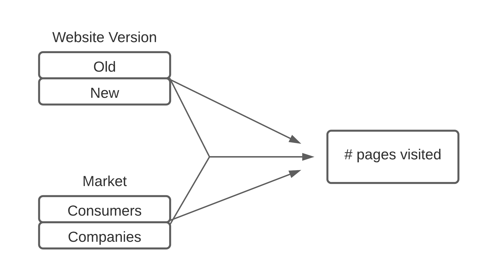

```{r setup, include=FALSE}
knitr::opts_chunk$set(echo=FALSE, message=FALSE, warning=FALSE, cache=TRUE)
```

# Part 1 - Design and set-up of true experiment 

## The motivation for the planned research 
>- Coronavirus
>- Technology enabled transition
>- Effect of online education on understanding

## The theory underlying the research  
>- Figlio et al. (2013): modest difference in exam scores in favour of the students only attending live lectures
>- Nguyen (2015): 92% of papers find online education to be at least as effective as live education
>- Finnegan (2021): results are marginally worse after the shift to online teaching

## Research questions 
>- "How is students' understanding of lecture material affected by attending the lecture live rather than online?"

## The related conceptual model 


## Experimental Design 
>- Pre-test Post-test randomized controlled trial
>- Participants divided randomly over live and online groups

## Experimental procedure 
>- One day each between pre-test, lecture, and post-test 
>- Pre-test and post-test consist of questions composed by the teacher giving the lecture
>- Questions should reflect the main learning goals of the lecture
>- Randomized block design based on pre-test scores
>- Students in both conditions follow the same lecture at the same time

## Measures
>- Pre-test as baseline measurement
>- Score is proportion of correct answers
>- Evaluate score$_\text{post-test}$ / score$_\text{pre-test}$

## Participants
>- Students recruited by asking for volunteers across a university campus
>- Compensation offered

## Suggested statistical analyses
>- $H_0$: no difference in student understanding of the lecture material between the two different conditions.
>- $H_1$: difference in student understanding
>- $m_0$: intercept only 
>- $m_1$: uses condition as predictor
>- ANOVA F-test

# Part 2 - Generalized linear models

## Question 1 Twitter sentiment analysis (Between groups - single factor) 

### Conceptual model


```{r, include=FALSE}

#during writing you could add "eval = FALSE",  kntr will than not run this code chunk (take some time do)

#source("working_dir.R")
#setwd(wd) 
# apple , note use / instead of \, which used by windows


#install.packages("twitteR", dependencies = TRUE)
library(twitteR)
#install.packages("RCurl", dependencies = T)
library(RCurl)
#install.packages("bitops", dependencies = T)
library(bitops)
#install.packages("plyr", dependencies = T)
library(plyr)
#install.packages('stringr', dependencies = T)
library(stringr)
#install.packages("NLP", dependencies = T)
library(NLP)
#install.packages("tm", dependencies = T)
library(tm)
#install.packages("wordcloud", dependencies=T)
#install.packages("RColorBrewer", dependencies=TRUE)
library(RColorBrewer)
library(wordcloud)
#install.packages("reshape", dependencies=T)
library(reshape)

################### functions

  
clearTweets <- function(tweets, excl) {
  
  tweets.text <- sapply(tweets, function(t)t$getText()) #get text out of tweets 

  
  tweets.text = gsub('[[:cntrl:]]', '', tweets.text)
  tweets.text = gsub('\\d+', '', tweets.text)
  tweets.text <- str_replace_all(tweets.text,"[^[:graph:]]", " ") #remove graphic
  
  
  corpus <- Corpus(VectorSource(tweets.text))
  
  corpus_clean <- tm_map(corpus, removePunctuation)
  corpus_clean <- tm_map(corpus_clean, content_transformer(tolower))
  corpus_clean <- tm_map(corpus_clean, removeWords, stopwords("english"))
  corpus_clean <- tm_map(corpus_clean, removeNumbers)
  corpus_clean <- tm_map(corpus_clean, stripWhitespace)
  corpus_clean <- tm_map(corpus_clean, removeWords, c(excl,"http","https","httpst"))
  

  return(corpus_clean)
} 

## capture all the output to a file.

################# Collect from Twitter

# for creating a twitter app (apps.twitter.com) see youtube https://youtu.be/lT4Kosc_ers
#consumer_key <-'your key'
#consumer_scret <- 'your secret'
#access_token <- 'your access token'
#access_scret <- 'your access scret'

source("your_twitter.R") #this file will set my personal variables for my twitter app, adjust the name of this file. use the provide template your_twitter.R

setup_twitter_oauth(consumer_key,consumer_scret, access_token,access_scret) #connect to  twitter app

##  Note that it will take the computer some to collect the tweets

tweets_J <- searchTwitter("#justinbieber", n=300, lang="en", resultType="recent") #300 recent tweets about Justin Bieber, in English
tweets_T <- searchTwitter("#taylorswift", n=300, lang="en", resultType="recent") #300 recent tweets about Taylor Swift, in English
tweets_B <- searchTwitter("#billieeilish", n=300, lang="en", resultType="recent") #300 recent tweets about Billie Eilish, in English

######################## Sentiment analysis

tweets_J.text <- laply(tweets_J, function(t)t$getText()) #get text out of tweets 
tweets_T.text <- laply(tweets_T, function(t)t$getText()) #get text out of tweets
tweets_B.text <- laply(tweets_B, function(t)t$getText()) #get text out of tweets

#taken from https://github.com/mjhea0/twitter-sentiment-analysis
pos <- scan('positive-words.txt', what = 'character', comment.char=';') #read the positive words
neg <- scan('negative-words.txt', what = 'character', comment.char=';') #read the negative words

source("sentiment3.R") #load algoritm
# see sentiment3.R form more information about sentiment analysis. It assigns a intereger score
# by substracitng the number of occurrence of negative words from that of positive words

analysis_J <- score.sentiment(tweets_J.text, pos, neg)
analysis_T <- score.sentiment(tweets_T.text, pos, neg)
analysis_B <- score.sentiment(tweets_B.text, pos, neg)


sem<-data.frame(analysis_J$score, analysis_T$score, analysis_B$score)


semFrame <-melt(sem, measured=c(analysis_J.score,analysis_T.score, analysis_B.score ))
names(semFrame) <- c("Candidate", "score")
semFrame$Candidate <-factor(semFrame$Candidate, labels=c("Justin Bieber", "Taylor Swift", "Billie Eilish")) 
```

### Homogeneity of variance analysis

```{r, include=FALSE}
library(car)
library(pander)
```

```{r, fig.cap="Boxplot of the sentiment values of the tweets for each celebrity."}
boxplot(semFrame$score ~ semFrame$Candidate)
```

```{r, fig.cap="Results of performing Levene's test on the three groups of tweets about the three celebrities."}
pander(leveneTest(semFrame$score, semFrame$Candidate, center = median))
```

### Visual inspection mean and distribution sentiments

```{r, include=FALSE}
library(ggplot2)

p <- semFrame %>% ggplot( aes(x=score)) + geom_histogram( color="#e9ecef", alpha=0.6, position = 'identity') + facet_grid(. ~ Candidate)
```

```{r, fig.cap="Bar plot for the tweet sentiment values for each celebrity."}
plot(p)
```

### Frequentist approach

#### Linear model

```{r, include = FALSE}
#include your code and output in the document
library(pander)
library(multcomp)

semFrame$CandidateF <-factor(semFrame$Candidate, levels =c("Justin Bieber", "Taylor Swift", "Billie Eilish"), labels =c("Justin Bieber", "Taylor Swift", "Billie Eilish"))

res.aov <- aov(score ~ Candidate, data=semFrame, na.action=na.exclude)
```

``` {r fig.cap="Effect pre-post measuring condition on the tweet sentiments of the three celebrities."}
pander(res.aov)
```

#### Post Hoc analysis

```{r, include=FALSE}
library(stats)
```
```{r, fig.cap="Results of performing Tukey's HSD."}
TukeyHSD(res.aov)
```

#### Report section for a scientific publication
In order to determine whether sentiment of tweets depend on the celebrity they are about, a null model and a model with celebrity added as a independent variable predictor have been constructed. Results showed that the fit was significantly better ($F(2, 897) = 44.39$, p. < 0.01) with the added predictor. We can therefore conclude that the Twitter user base tweets differently depending on the three celebrities in the data set. Further analysis using Post Hoc analysis using Tukey's Honest Significant Difference test showed that there is a significant difference in tweet sentiment distribution in all three celebrity pairs, Taylor Swift - Justin Bieber (p. < 0.01), and Billie Eilish - Justin Bieber (p. < 0.01), and Taylor Swift - Billie Eilish (p. < 0.01).

### Bayesian Approach

#### Model description

$$
\begin{aligned}
\mu_{\text{celebrity}} & = N(a_{\text{celebrity}}, \sigma) \\ a & \sim N(0, 2) \\ \sigma & \sim U(0.0001, 5)
\end{aligned}
$$

```{r, include=FALSE}
semFrame <- subset(semFrame, select = c(score, CandidateF)) 
x <- seq(-5, 5, length=100)
y <- dnorm(x, mean=0, sd=2)
```

```{r, fig.cap="Sentiment values of all tweets."}
hist(semFrame$score)
```

```{r, fig.cap="Normal distribution with a mean of 0 and a standard deviation of 2."}
plot(x, y, type="l", lwd=1)
```


#### Model comparison

```{r, results='hide', include=FALSE}
library("rstan")
library("rethinking")

m0 <-ulam(
  alist(
    score ~ dnorm(mu, sigma), 
    mu <- a,
    a ~ dnorm(0, 2),
    sigma ~ dunif(0.0001, 5)),  
  data =  semFrame ,iter = 10000, chains = 4, cores = 4, control=list(adapt_delta=.99), log_lik=TRUE
)

m1 <-ulam(
 alist(
   score ~ dnorm(mu, sigma),
   mu <- a[CandidateF] ,
   sigma ~  dunif(0.0001, 5),
   a[CandidateF] ~ dnorm(0, 2)),
 data =  semFrame ,iter = 10000, chains = 4, cores = 4, control=list(adapt_delta=.99), log_lik=TRUE
)
```

```{r fig.cap="Confidence intervals for the parameters of the model with celebrity added as a predictor."}
plot(precis(m1, depth=2, prob = .95))
```

```{r fig.cap="Comparison of the WAIC score for each model."}
plot(compare(m0, m1, func=WAIC))
```

#### Comparison celebrity pair

```{r, include=FALSE}
library(rjags)
devtools::install_github("rasmusab/bayesian_first_aid")
library(BayesianFirstAid)
jbSub <- subset(semFrame, (CandidateF == "Justin Bieber"))
tsSub <- subset(semFrame, (CandidateF == "Taylor Swift"))
beSub <- subset(semFrame, (CandidateF == "Billie Eilish"))
```

``` {r, fig.cap="Results of performing the bayes t-test on the pair Justin Bieber - Taylor Swift."}
plot(bayes.t.test(jbSub$score, tsSub$score))
```

``` {r, fig.cap="Results of performing the bayes t-test on the pair Justin Bieber - Billie Eilish."}
plot(bayes.t.test(jbSub$score, beSub$score))
```

``` {r, fig.cap="Results of performing the bayes t-test on the pair Taylor Swift - Billie Eilish."}
plot(bayes.t.test(tsSub$score, beSub$score))
```

## Question 2 - Website visits (between groups - Two factors)

### Conceptual model


### Visual inspection

```{r, include=FALSE}
library(ggplot2)
library(magrittr)
library(dplyr)     
web_visit <- read.csv("webvisit0.csv")
web_visit$version <- factor(x=web_visit$version, labels=c("old", "new"))
web_visit$portal <- factor(x=web_visit$portal, labels=c("consumers", "companies"))
```

```{r, fig.cap="Histogram showing page visits on the website over all factors."}
p <- web_visit %>% ggplot(aes(x=pages)) + geom_histogram(bins=10)
plot(p)
```

```{r, fig.cap="Histograms of page visits on the website per independent variable."}
p <- web_visit %>% ggplot( aes(x=pages)) + geom_histogram(bins=10) + facet_grid(portal ~ version)
plot(p)
```

```{r, fig.cap="Boxplots of page visits on the website per independent variable."}
p <- web_visit %>% ggplot( aes(y=pages)) + geom_boxplot() + facet_grid(portal ~ version, scales = "free_x", space = "free_x") + theme( axis.title.x=element_blank(), axis.text.x=element_blank(), axis.ticks.x=element_blank())
plot(p)
```

### Normality check

```{r, include=FALSE}
m<-mean(web_visit$pages)
std<-sqrt(var(web_visit$pages))
```

```{r, fig.cap="Normal distribution fitted to data of page visits"}
p <- web_visit %>% ggplot( aes(x=pages)) + geom_histogram(aes(y =..density..), bins=15) + stat_function(fun = dnorm, args = list(mean = mean(web_visit$pages), sd = sd(web_visit$pages)))

plot(p)
```

### Frequentist Approach

#### Model analysis

```{r}
library(car)
library(pander)

pander(leveneTest(web_visit$pages, interaction(web_visit$version , web_visit$portal)))
```

```{r, include=FALSE}
model0 <- lm(pages ~ 1 , data = web_visit, na.action = na.exclude)
model1 <- lm(pages ~ version , data = web_visit, na.action = na.exclude)
model2 <- lm(pages ~ portal , data = web_visit, na.action = na.exclude)
model3 <- lm(pages ~ version + portal , data = web_visit, na.action = na.exclude)
model4 <- lm(pages ~ version + portal + version:portal , data = web_visit, na.action = na.exclude)
```

```{r}
pander(anova(model0,model1), caption = "Website version as main effect on page visits")
pander(anova(model0,model2), caption = "Portal type as main effect on page visits")
pander(anova(model3,model4),caption = "Interation effect on top of two main effects")
pander(anova(model4),caption = "Effect of Website version, Portal type and interaction effect on page visits")
```

```{r, include=FALSE}
library(AICcmodavg)
models <-list(model0, model1, model2, model3, model4)
model.names <-c("model0","model1","model2","model3","model4")
```


```{r}
pander(aictab(cand.set = models, modnames=model.names))
```

#### Simple effect analysis

```{r, fig.cap="Bar plot showing the mean page visits per independent variable."}
bar <- ggplot(web_visit, aes(portal , pages, fill = version))
bar + stat_summary(fun.y = mean, geom = "bar", position="dodge")
```

```{r, include=FALSE}
web_visit$simple <- interaction(web_visit$version, web_visit$portal) #merge two factors levels(Lec7g$simple) #to see the level in the new factor
levels(web_visit$simple)

contrastConsumers <-c(1,-1,0,0) #Only the consumer portal data 
contrastCompanies <-c(0,0,1,-1) #Only the company portal data


SimpleEff <- cbind(contrastConsumers,contrastCompanies)
contrasts(web_visit$simple) <- SimpleEff 
```

```{r}
simpleEffectModel <-lm(pages ~ simple , data = web_visit, na.action = na.exclude) 
pander(summary.lm(simpleEffectModel))
```

#### Report section for a scientific publication
A linear model was fitted on the amount of page visits for users of a website, taking as independent variables the website version (new or old) and the user portal (consumer or company). The analysis found a significant main effect ($F(1,995)=36.2,\ p.< 0.01$) for the website version as well as for the portal ($F(995,1)=178.8,\ p.<0.01$). Moreover, the analysis found a significant two-way interaction effect ($F(1,995)=46.2,\ p.<0.01$). A Simple Effect analysis was conducted to further examine the two-way interaction between the independent variables. It revealed a significant ($t=9.22,\ p. 0.01$) difference for website version in the company portal of the website but no significant effect ($t=13.4,\ p=0.67$) for the website version in the consumer portal.

### Bayesian Approach

#### Model description

$$
\begin{aligned}
\text{PageVisits} & \sim N(\mu, \sigma) \\
\mu & = a + b \cdot \text{Version} + c \cdot \text{Portal} + d\cdot \text{Version} \cdot \text{Portal} \\
a & \sim \text{Gamma}(1, 2) \\
b & \sim N(0, 1) \\
c & \sim N(0, 1) \\
d & \sim N(0, 1) \\
\sigma & \sim U(0.1, 2)
\end{aligned}
$$

```{r, fig.cap="Gamma distribution (1, 2) fitted to data of page visits"}
p <- web_visit %>% ggplot( aes(x=pages)) + geom_histogram(aes(y =..density..), bins=15) + stat_function(fun = dgamma, args = list(shape = 1, scale=2))
plot(p)
```

#### Model comparison

```{r, results = 'hide', include=FALSE}
web_visit <- subset(web_visit, select = c(pages,version, portal )) 
web_visit$versionN <- as.numeric(web_visit$version)
web_visit$portalN <- as.numeric(web_visit$portal)


m0 <-map2stan( alist(
    pages ~ dnorm(mu, sigma), mu <- a ,
    a ~ dgamma(shape=1, scale=2),
    sigma ~ dunif(0.1, 2)
  ),  data = web_visit,iter = 10000, chains = 4, cores = 4
)


m1 <-map2stan( alist(
  pages ~ dnorm(mu, sigma), mu <- a + b*versionN,
    a ~ dgamma(shape=1, scale=2),
  b ~ dnorm(0, 1),
  sigma ~ dunif(0.1, 2) ), data = web_visit,iter = 10000, chains = 4, cores = 4
)

  
m2 <-map2stan( alist(
  pages ~ dnorm(mu, sigma), mu <- a + c*portalN ,
    a ~ dgamma(shape=1, scale=2),
  c ~ dnorm(0, 1),
  sigma ~ dunif(0.1, 2)), 
  data = web_visit,iter = 10000, chains = 4, cores = 4
)

m3 <-map2stan( alist(
  pages ~ dnorm(mu, sigma), mu <- a + b*versionN + c*portalN ,
    a ~ dgamma(shape=1, scale=2),
  b ~ dnorm(0, 1),
  c ~ dnorm(0, 1), sigma ~ dunif(0.1, 2)),  
  data = web_visit,iter = 10000, chains = 4, cores = 4
)

m4 <-map2stan( alist(
  pages ~ dnorm(mu, sigma),
  mu <- a + b*versionN + c*portalN + d*versionN*portalN, 
    a ~ dgamma(shape=1, scale=2),
  c(b,c,d) ~ dnorm(0, 1),
  sigma ~ dunif(0.1, 2)),  
  data = web_visit,iter = 10000, chains = 4, cores = 4
)
```


```{r, fig.cap="WAIC comparison between Bayesian models capturing effects of different variables."}
plot(compare(m0,m1,m2,m3,m4, func=WAIC))
```


```{r}
pander(compare(m0,m1,m2,m3,m4))
pander(precis(m4, prob= .95))
``` 

# Part 3 - Multilevel model

## Visual inspection

```{r, fig.cap="Histogram of score"}
exp_data = read.csv("set1.csv")
p <- exp_data %>% ggplot( aes(x=score)) + geom_histogram(bins=15) + theme()
plot(p)
```

```{r, fig.cap="Scatterplot relation between score and session"}
p <- exp_data %>% ggplot( aes(x=session, y=score)) + geom_point(alpha=0.25) + theme()
plot(p)
```

```{r, fig.cap="Mean score and standard error over sessions."}
library(Rmisc)

tgc = summarySE(exp_data, measurevar="score", groupvars=c("session"))
p <- tgc %>% ggplot(aes(x=session, y=score, alpha=N*2)) + 
    geom_errorbar(aes(ymin=score-se, ymax=score+se), width=.1) +
    geom_line() +
    geom_point()

plot(p)
```

## Frequentist approach

### Multilevel analysis

```{r}
library(nlme)

model0 <- lme(score ~ 1 , random = ~1|Subject, data = exp_data, method="ML")
summary(model0)
```

```{r}
intervals(model0, 0.95)
```

```{r}
model1 <- lme(score ~ session , random = ~1|Subject, data = exp_data, method="ML")
summary(model1)
```

```{r}
intervals(model1, 0.95)
```

```{r}
pander(anova(model0, model1), caption = "Model comparison.")
```

### Report section for a scientific publication
<!--
Write a small section for a scientific publication, in which you report the results of the analyses, and explain the conclusions that can be drawn.
-->
To investigate whether session has an impact on people's scores and wheter there is a significant variance between the participants in their score, multilevel analysis was performed. A model with a random intercept only and a model with a random intercept and fixed effects were created. There was a significant relationship between session and score, $M = 116.8139$ (95% CI 112.70, 120.93), $p = 0$. The relationship between score and session showed significant variance in intercepts across subjects, $SD = 46.51$ (95% CI 43.67, 49.54), $p = 0$. 

## Bayesian approach

### Model description

$$
\begin{aligned}
\text{Score} & \sim N(\mu, \sigma) \\
\mu & = a + a_\text{Subject}[Subject] + b * \text{session} \\
a_\text{Subject}[Subject] & \sim N(0, \sigma_\text{Subject}) \\
\sigma_\text{Subject} & \sim \text{Cauchy}(0, 100)T(0, \infty) \\
a & \sim N(0, 100) \\
b & \sim N(0, 5) \\
\sigma & \sim \text{Cauchy}(0,50)T(0, \infty) \\
\end{aligned}
$$

### Model comparison

```{r, results='hide'}
exp_data_1 = data.frame(exp_data)
exp_data_1 = exp_data_1[exp_data_1$Subject < 100,]
exp_data_1$Subject <- exp_data_1$Subject + 1

m0 <-ulam( alist(
    score ~ dnorm(mu, sigma), 
    mu <- a ,
    a ~ dnorm(0, 100),
    sigma ~ dcauchy(0, 50)
  ),  data = exp_data_1, iter = 10000, chains = 4, cores = 4, control=list(adapt_delta=.99), log_lik=TRUE
)

m1 <-ulam( alist(
    score ~ dnorm(mu, sigma), 
    mu <- a + a_Subject[Subject] ,
    
    a_Subject[Subject] ~ dnorm(0, sigma_Subject),
    sigma_Subject ~ dcauchy(0, 100),
    
    a ~ dnorm(0, 100),
    sigma ~ dcauchy(0, 50)
  ),  data = exp_data_1, iter = 10000, chains = 4, cores = 4, control=list(adapt_delta=.99), log_lik=TRUE
)

m2 <-ulam( alist(
    score ~ dnorm(mu, sigma), 
    mu <- a + a_Subject[Subject] + b * session,
    
    a_Subject[Subject] ~ dnorm(0, sigma_Subject),
    sigma_Subject ~ dcauchy(0, 100),
    
    a ~ dnorm(0, 100),
    b ~ dnorm(0, 5),
    sigma ~ dcauchy(0, 50)
  ),  data = exp_data_1, iter = 10000, chains = 4, cores = 4, control=list(adapt_delta=.99), log_lik=TRUE
)

compare(m0,m1,m2)
```

```{r fig.cap="Comparing three Bayesian models of increasing complexity."}
plot(compare(m0,m1,m2))
```

### Estimates examination

```{r, fig.cap="Parameters of m2."}
plot(m2)
```


